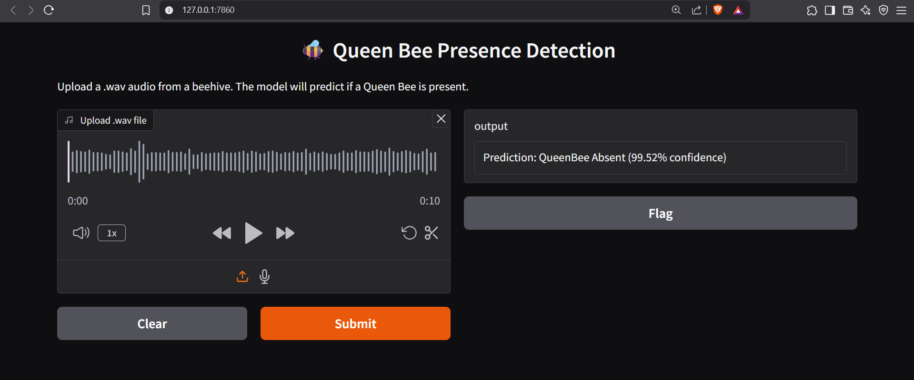

# 🐝 Queen Bee Presence Detection using CNN and MFCC


## 🧠 Project Overview

This project detects the **presence or absence of a queen bee** in hive audio recordings using a **1D Convolutional Neural Network (CNN)** trained on **MFCC (Mel-Frequency Cepstral Coefficient)** features.

---

## 🔄 Life Cycle of the ML Model

### 📅 1. Dataset

* Path: `dataset/`
* Two subfolders:

  * `QueenBee Present/`
  * `QueenBee Absent/`
* Each contains `.wav` audio files (5 seconds duration each)

---

### 🎧 2. Feature Extraction

* **Library**: `librosa`
* **Sampling Rate**: 22050 Hz
* **Duration**: 5 seconds
* **Technique**: Extract 13 **MFCCs** from each audio file
* Padding is used to ensure all clips are exactly 5 seconds
* The mean of the MFCCs across time is used as the feature vector (shape: `(13,)`)

---

### 🗋 3. Data Labeling and Encoding

* Labels:

  * `QueenBee Absent` → `0`
  * `QueenBee Present` → `1`
* Encoded using `LabelEncoder`

---

### 🗐 4. Train/Validation/Test Split

* Stratified sampling ensures balanced class distribution
* Split Ratio:

  * Train: 70%
  * Validation: 15%
  * Test: 15%

---

### 🔧 5. Data Reshaping for CNN

* Feature shape from `(samples, 13)` to `(samples, 13, 1)`
* Needed for 1D CNN compatibility

---

### 📊 6. CNN Model Architecture

```python
model = Sequential([
    Conv1D(64, kernel_size=3, activation='relu', input_shape=(13, 1)),
    BatchNormalization(),
    MaxPooling1D(pool_size=2),

    Conv1D(128, kernel_size=3, activation='relu'),
    BatchNormalization(),
    MaxPooling1D(pool_size=2),

    Flatten(),
    Dense(128, activation='relu'),
    Dropout(0.3),
    Dense(1, activation='sigmoid')  # Binary classification
])
```

* **Loss Function**: `binary_crossentropy`
* **Optimizer**: `Adam`
* **Metric**: `accuracy`
* **EarlyStopping**: Monitors validation loss (patience = 5)

---

### 🏋️‍♂️ 7. Training Summary

* Epochs: 50
* Batch Size: 32
* Early stopping applied

---

### 🔢 8. Model Evaluation

* Visualized training vs validation accuracy
* Final metrics computed on the test set (accuracy, confusion matrix, etc.)

---

### 📃 9. Saving the Model

```python
model.save("model.h5")
```

* Optional: Save scalers or preprocessors using `pickle`

```python
with open("scaler.pkl", "wb") as f:
    pickle.dump(scaler, f)
```

---

### 🚀 10. Deployment Plan (Optional)

* Load model and scaler:

```python
model = tf.keras.models.load_model("model.h5")
with open("scaler.pkl", "rb") as f:
    scaler = pickle.load(f)
```

* Deploy using:

  * Gradio for web UI
  * Flask/FastAPI for REST APIs

---

## 📊 Results (Example Placeholder)

| Metric         | Value |
| -------------- | ----- |
| Train Accuracy | \~98% |
| Val Accuracy   | \~96% |
| Test Accuracy  | TBD   |

---

## 📄 Requirements

* Python 3.x
* TensorFlow / Keras
* librosa
* scikit-learn
* numpy, pandas, matplotlib

---

## 📖 References

* [Librosa Documentation](https://librosa.org/doc/latest/)
* Queen Bee Audio Dataset (internal)

---

## ❤️ Credits

Developed by Omprasad Ajgaonkar.
